# Report

This is a report on load prediction using weather data and load data from the NYISO (New York Independent System Operator).

## Available data

Four datasets were given:

- `load_actual.csv`
- `load_forecast.csv`
- `weather.csv`
- `zones_and_stations.csv`

The first step was to pre-process this data.

## Data pre-processing

This section contains details about pre-processing of each dataset. Code used for pre-processing can be found in the module `ens_load_forecast.data_preprocessing`.

### Pre-processing of `load_actual.csv`

Almost no pre-processing.

### Pre-processing of `load_forecast.csv`

- Forecasts that were issued after 5AM the day before were discarded.
- Only most recent forecast was kept for each target date.

### Pre-processing of `weather.csv`

This dataset required more pre-processing steps than the others:

- Dates were converted from UTC to Eastern time.
- Forecasts that were issued after 5AM the day before were discarded.
- Data from `zones_and_stations.csv` was joined to the forecasts.
- Data was aggregated using a weighted sum (using stations weights from `zones_and_stations.csv`)
- Rows with missing data were dropped.

To accelerate this study, only the following weather data were used:

- `tmp` (Temperature, deg F)
- `dpt` (Dew point temperature, deg F)
- `sky` (Sky cover, percent)
- `wdr` (Wind drection, deg)
- `wsp` (Wind speed, knots)
- `gst` (Wind gust, knots)
- `psn` (Probability of snow, percent)

### Merging

Then, the three resulting datasets were merged into a single `DataFrame` with the following structure:

- `index`: target date (Eastern time)
- `columns`:
  - load (target)
  - forecast_load
  - zone
  - One column per aggregated weather data

## Features engineering

Other features were then added to the dataset:

- Features were scaled when relevant (`psn` and `sky`).
- `wdr` was split in two features `cos(wdr)` and `sin(wdr)`.
- A month feature was added and one-hot encoded. (January, February, ...)
- A day of week feature was added and one-hot encoded. (Monday, Tuesday, ...)
- A time of day feature was added and one-hot encoded. (Morning, Working hours, Evening)

This data structure will allow for an easier data analysis.

## Data analysis

### Target load

Target load has a very seasonal evolution. It is expected to heavily depend on the hour, on the season, on the week day...
This is illustrated by the two following plots.

- The first plot shows that each zone has a different order of magnitude of load, and that daily and yearly spikes occur.

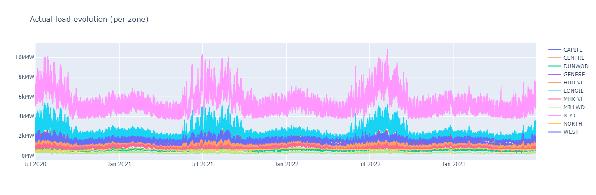

- The second plot is a heatmap. X-axis represents the date, y-axis the hour.

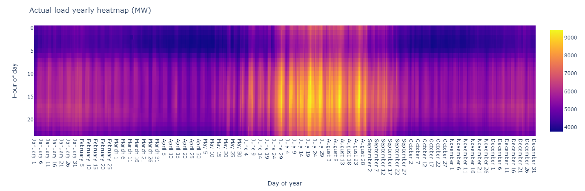

On this second plot we can see that in N.Y.C., load spikes around 2PM each day, and that load increases a lot around July.

We can also see the load is periodically lower (around week frequency). This probably indicates a lower load on weekends.

- Finally, we plot average load per zone on a map, to get a spatial idea of the problem.

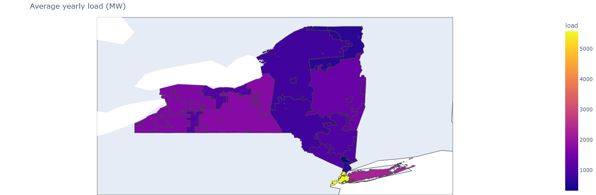

Despite representing the smallest zone, N.Y.C. is the zone with the highest load.

### Forecast error

We are given an unusual input for this study: an already forecast value of the load. We want to assess its accuracy.

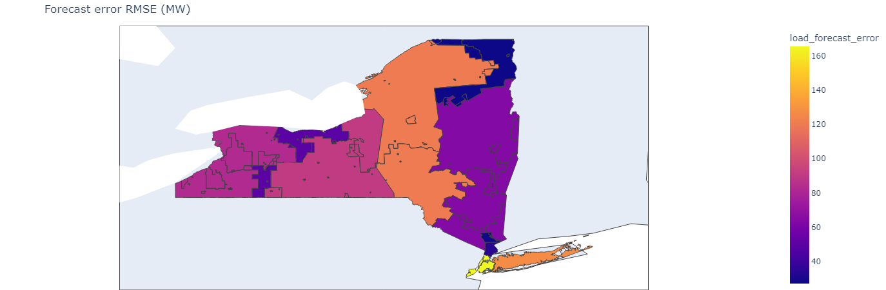

RMSE changes a lot from zone to zone, which was expected from the fact that average load changes a lot as well. We can use a %MAE metric here instead.

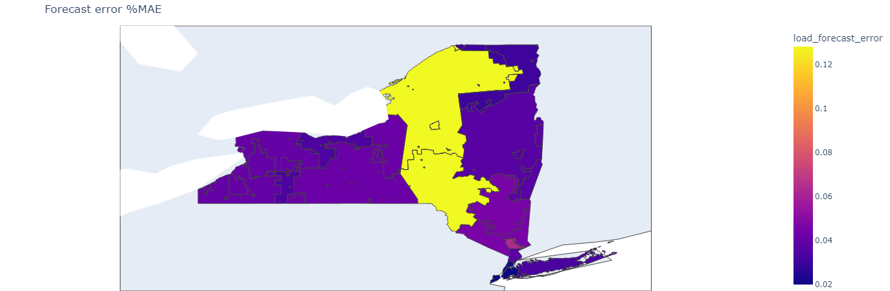

On this map we can see that forecast from NYISO is the least accurate for Mohawk Valley, and the most accurate for N.Y.C.
This map foretells which zones forecasts we are likely to improve. We can't expect much significant improvement for N.Y.C., but Mohawk Valley has the most potential for improvement.

### Features potential

Finally, we can have a first look at features potential using a correlation matrix. Here, this matrix was only plotted for Mohawk Valley, but the same can be done for any zone.

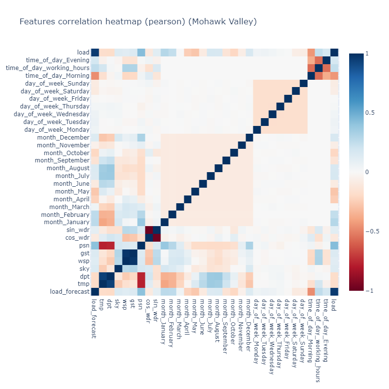

From this heatmap, we can see that the features that are the most correlated with our target (`load`) are:

- The load forecast (0.95)
- The Morning boolean (-0.44)
- The probability of snow (0.43)

We can also see that some features are correlated with each other:

- sine and cosine of wind direction (-0.98)
- probability of snow an temperature and dew point temperature

We could reconsider using some features given these results.

However, correlation matrix does not tell the full story. Sometimes, features can exhibit poor correlation because their relation to the target is quadratic for instance. Therefore, we also provide a scatter matrix.

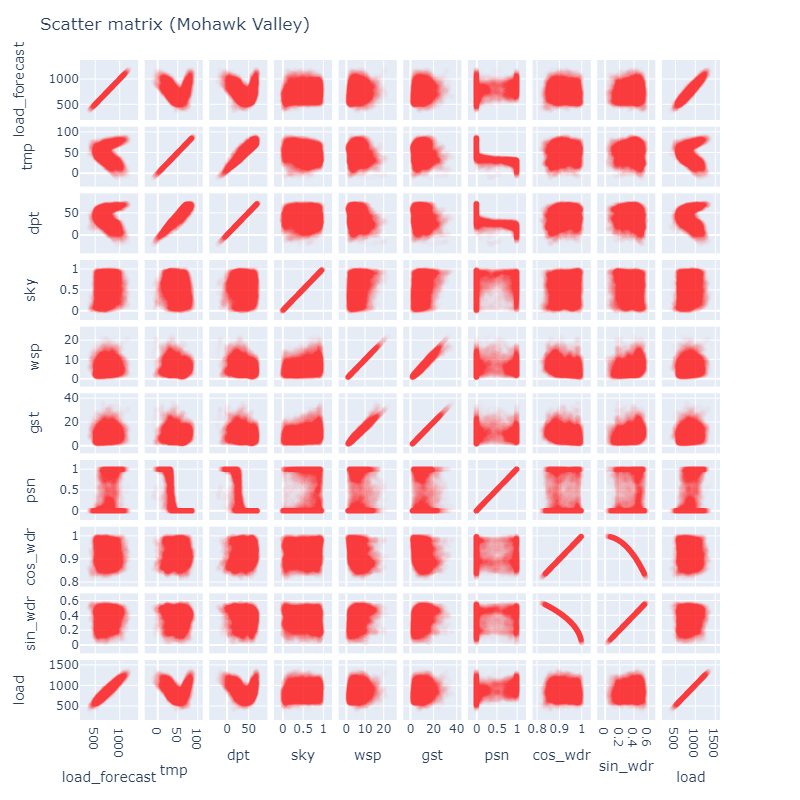

This scatter matrix shows for instance that the temperature and dew point temperature low correlation was due to two tendencies: load increases at low and high temperature.

Therefore, this feature might be more useful transformed.

## Modeling

### Approach

We chose to train one model per zone. The philosophy behind this approach is:

- `NYISO-wide` load can still be estimated by summing the models outputs.
- If models perform well in `zone A` but poorly in `zone B`, then one might want to focus their activity on `zone A`.

### Train / test split

We chose to use the last 25% of the dataset as a test set. We chose not to shuffle in order to simulate real modelling conditions: A model is trained on past data, then put in production on current data.

### Chosen models

We chose to compare 5 very classical models:

- A `naive model`, that directly returns NYISO forecast. This model serves as a baseline to compare model performance.
- A `linear regression`, a classical, fast approach with great explainability.
- A `polynomial regression` of degree 2.
- A `gradient boosting regression`.
- A `random forest regression`.

The last two are much less explainable models. However, `random forests` are known to outperform any other model on tabular data and will serve as comparison for the more classical models.

### Evaluation metrics

We mainly use a metric we call `Normalized Root Mean Square Error`. It is computed as the ration between the model's RMSE and the naive model's RMSE.

It represents how much better the model is compared to NYISO forecasts.

### Results on test set

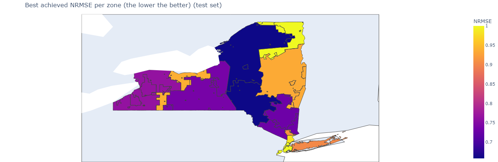

As foretold by the initial data analysis, Mohawk Valleys is the zone where we see the most improvements relative to the baseline (35% lower RMSE).
We can also see that two zones have seen no improvement regardless of the model (N.Y.C. and North).

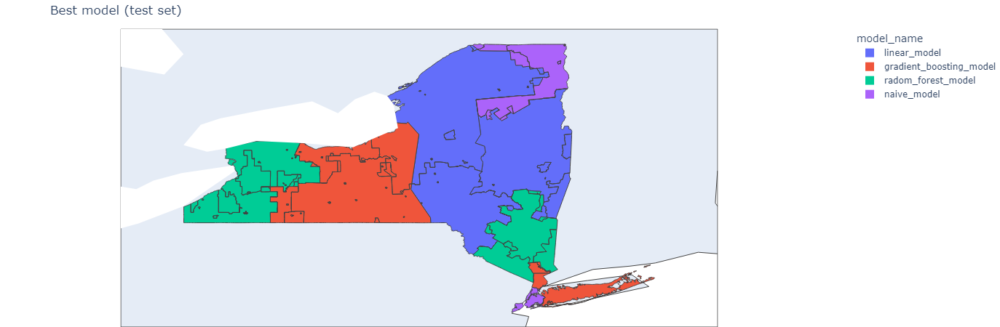

Surprisingly, there does not seem to be a best overall model. However, we can see that polynomial regression performs poorly and is never the best model in any zone. More advanced feature selection could improve its performances.

### Results on train set and comment on overfitting

By plotting the same maps on the train set, we can clearly see that the `random forest` has overfit. It shows great results on the training set, but poor results on the testing set.
We could try and reduce the number of estimators to prevent this phenomenon.

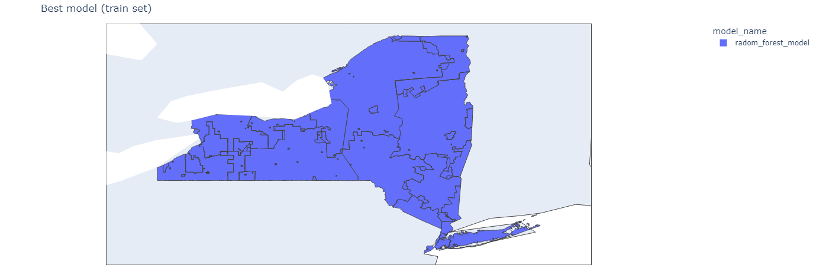

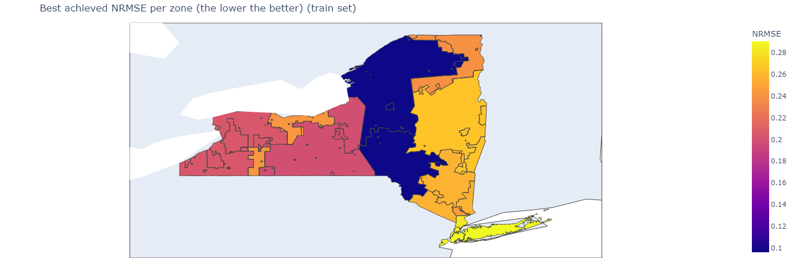

We can see that the model always perform at least 80% better than the baseline on the training set.

Note that scores are very different here. This is probably caused by improvements of NYISO forecasts over time, resulting in much poorer accuracy of the baseline on the train set than on the test set.

# APPENDIX ON REPOSITORY STRUCTURE

## `paths.py`

This module contains all paths to models and data.

## `constants.py`

This module contains constants for the rest of the repository. For instance, the list of used features is defined in the constant `FEATURES_LIST`.

## `plot_params.py`

This module contains generic parameters for plotly.

## `graphs.py`

This module contains all the methods requires to plot the figures of this report. The only library used is `plotly`.

## `data_preprocessing.py`

This module contains all the pre-processing functions required to load, clean and aggregate the data.

## `features_engineering.py`

This module handles all extra features added to the data (time of day, cos and sin of wind direction...)

## `models.py`

This module handles model training, scoring and saving.

## Misc

- The data folder contains a file named `map_data.geojson`, that was downloaded from NYISO and containing zones boundaries.
- A lot of files are generated from a personal `cookiecutter` template. They mostly setup dev tools. For instance, one can run `ruff` using the command `tox -e ruff` or launch all tests with `tox -e test` (uses `pytest`)
